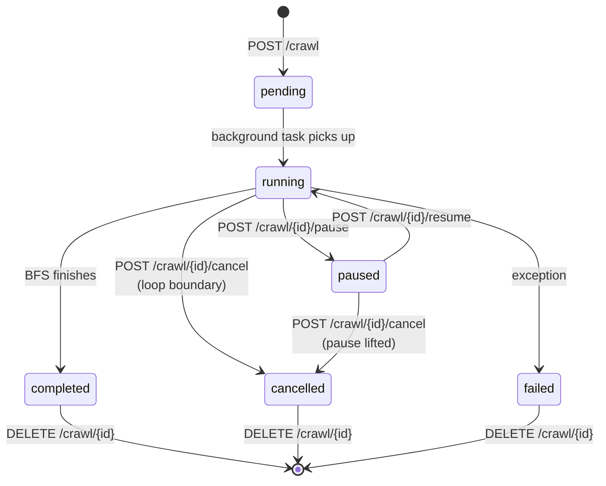
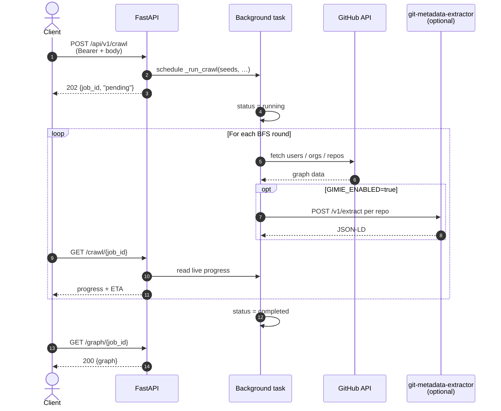

# Open Pulse Crawler — REST API

Base path: `/api/v1`.

Interactive Swagger docs at `/api/v1/docs` and the raw OpenAPI document at
`/api/v1/openapi.json` when the server is running. Behind Nginx the API is reachable
at `http://localhost/api/v1` (or `http://localhost:${OPC_PORT}/api/v1` if overridden);
running uvicorn directly puts it on `http://localhost:8000/api/v1`.

## Authentication

Every endpoint except `GET /api/v1/health` requires a Bearer token:

```
Authorization: Bearer <token>
```

The token is validated against the `API_TOKEN` environment variable on the server using
a constant-time comparison (`secrets.compare_digest`). The auth dependency lives in
`src/open_pulse_crawler/auth.py`.

| Scenario                       | Status    | Detail                                    |
| ------------------------------ | --------- | ----------------------------------------- |
| Missing / non-Bearer header    | `401/403` | Not authenticated                         |
| Invalid token                  | `401`     | Invalid or missing API token              |
| `API_TOKEN` env var not set    | `503`     | `API_TOKEN` is not configured on the server |

## Job lifecycle



`pending` flips to `running` as soon as the background task picks up the job. Cancellation
is cooperative — the BFS loop checks the cancel flag at round boundaries, so the partial
graph collected so far is preserved.

## Request flow



## Endpoints

### `GET /api/v1/health` — public

```json
{
  "status": "ok",
  "version": "0.1.0"
}
```

### `POST /api/v1/crawl` — start a crawl

Starts a background BFS crawl and returns immediately with a job ID.

**Request body**

| Field                | Type          | Required | Default | Description                                |
| -------------------- | ------------- | -------- | ------- | ------------------------------------------ |
| `seeds`              | `string[]`    | yes      | —       | Seed nodes (users, orgs, or repos)         |
| `max_rounds`         | `int`         | no       | `2`     | BFS rounds (1–10)                          |
| `crawl_dependencies` | `bool`        | no       | `false` | Crawl downstream dependencies (SBOM)       |
| `crawl_dependents`   | `bool`        | no       | `false` | Crawl upstream dependents ("Used by")      |
| `min_stars`          | `int`         | no       | `0`     | Min stars for dep/dependent filtering      |
| `max_dependents`     | `int \| null` | no       | `null`  | Max dependents to fetch per repo (≥1)      |
| `max_contributors`   | `int \| null` | no       | `null`  | Optional per-repo contributor cap — take up to N (≥1), never skip; `null` = no cap — see below |
| `batch_size`         | `int \| null` | no       | `null`  | Concurrent nodes per round (≥1)            |

```json
{
  "seeds": ["torvalds", "sdsc-ordes/gimie"],
  "max_rounds": 3,
  "crawl_dependents": true,
  "min_stars": 10,
  "max_dependents": 100,
  "max_contributors": 200
}
```

#### `max_contributors`

An **optional** per-repo contributor limit. When set, at most N contributors
are recorded and queued per repo, and a repo with more is **truncated to its
top N — it still contributes, it is never skipped**. Owner / fork / dependency
/ dependent edges are unaffected.

Omitting the field (the default) means **no cap**: every contributor the GitHub
API returns is recorded as a `CONTRIBUTES_TO` edge and queued for crawling.
GitHub itself caps the contributors endpoint at ~500 for very large repos. The
repo's total `contributor_count` is always recorded as metadata.

Like every cap in this API, `max_contributors` means *take up to N* — never
*skip to 0*.

**Response** `202 Accepted`

```json
{
  "job_id": "d290f1ee-6c54-4b01-90e6-d701748f0851",
  "status": "pending"
}
```

> Note: gimie hybrid extraction (JSON-LD enrichment) is configured server-side via
> `GIMIE_*` environment variables, not per-request — see
> [`docs/DEPLOYMENT.md`](./DEPLOYMENT.md).

### `POST /api/v1/crawl/graphql` — start a GraphQL-backed crawl

Accepts the **same request body** as `POST /api/v1/crawl` and produces the same graph,
but fetches user / org / repo data via GitHub's GraphQL API — roughly one query per
entity instead of dozens of REST calls. Contributors, SBOM dependencies, and the
"Used by" dependents graph still fall back to REST. Org-level fields require a token
with `read:org` scope. Gimie hybrid mode is not available on this endpoint.

**Response** `202 Accepted` — identical shape to `POST /api/v1/crawl`.

### `GET /api/v1/crawl/{job_id}` — status, progress, ETA

Returns status, summary counts, and (for running jobs) live BFS progress.

**Response** `200`

```json
{
  "job_id": "d290f1ee-6c54-4b01-90e6-d701748f0851",
  "status": "running",
  "detail": null,
  "users": 12,
  "orgs": 3,
  "repos": 87,
  "started_at": "2026-05-05T08:30:15Z",
  "completed_at": null,
  "current_round": 2,
  "nodes_processed": 156,
  "nodes_in_queue": 234,
  "estimated_completion_at": "2026-05-05T08:31:42Z"
}
```

| Field                     | Populated when                                  |
| ------------------------- | ----------------------------------------------- |
| `started_at`              | the job has started running                     |
| `completed_at`            | the job has reached a terminal state            |
| `current_round`           | the job is `running`                            |
| `nodes_processed`         | the job is `running`                            |
| `nodes_in_queue`          | the job is `running`                            |
| `estimated_completion_at` | running, ≥1 node processed, queue non-empty     |

The ETA is a best-effort linear extrapolation from the current node-processing rate.
It drifts mid-BFS because the queue grows as the crawl expands; treat it as a hint, not
a guarantee.

`status` values: `pending`, `running`, `paused`, `completed`, `cancelled`, `failed`.
Returns `404` if the job ID is unknown.

### `GET /api/v1/jobs` — list all jobs

Returns every job currently in the in-memory registry, newest first
(by `completed_at`, then `started_at`).

**Query**

| Param           | Type        | Description                                          |
| --------------- | ----------- | ---------------------------------------------------- |
| `status_filter` | `JobStatus` | Narrow to one status (e.g. `?status_filter=completed`) |

**Response** `200`

```json
{
  "jobs": [
    {
      "job_id": "d290f1ee-6c54-4b01-90e6-d701748f0851",
      "status": "completed",
      "started_at": "2026-05-05T08:30:15Z",
      "completed_at": "2026-05-05T08:31:38Z",
      "users": 42,
      "orgs": 5,
      "repos": 87,
      "detail": null
    }
  ],
  "total": 1
}
```

### `GET /api/v1/graph/{job_id}` — fetch the graph

Graph data for a crawl job. By default only a **completed** job is served; pass
`?partial=true` to also read a partial graph from a running / cancelled / failed job,
or to recover a job by ID after its in-memory record was lost (container restart) from
the last per-round disk snapshot.

**Query parameters**

| Param     | Type   | Default | Description                                              |
| --------- | ------ | ------- | -------------------------------------------------------- |
| `partial` | `bool` | `false` | Allow reading a non-completed / snapshot-recovered graph |

**Response** `200`

```json
{
  "job_id": "d290f1ee-6c54-4b01-90e6-d701748f0851",
  "graph": {
    "users": { "torvalds": { "login": "torvalds", "...": "..." } },
    "orgs": {},
    "repos": {}
  },
  "partial": false,
  "status": "completed",
  "rounds_completed": 2
}
```

Without `?partial=true`: `404` if the job ID is unknown, `409 Conflict` if the job has
not completed. With `?partial=true`: returns the latest round snapshot, or `404`/`409`
if no snapshot exists yet.

### Lifecycle controls

Pause, resume, and cancel are cooperative — they set flags on the live crawler instance
which the BFS loop checks at round boundaries. In-flight network calls finish first, so
the graph stays consistent (partial but not torn).

#### `POST /api/v1/crawl/{job_id}/pause`

Pauses at the next round boundary. Status flips to `paused` immediately; the loop sleeps
in 1-second ticks until `resume` or `cancel`.

`409` if the job isn't `running` or already `paused`.

#### `POST /api/v1/crawl/{job_id}/resume`

Lifts a previous pause. Also resumes a `cancelled` or `failed` job: it continues from
the persisted BFS state (queue + visited set + graph) instead of re-crawling from the
seeds, and works even after the in-memory job record was lost — as long as the job's
`state.json` + `request.json` are still on disk under `OPC_DATA_DIR/{job_id}/`.

`409` if the job is `running`/`pending`, or if there is no resumable state.

#### `POST /api/v1/crawl/{job_id}/cancel`

Asks the BFS loop to stop at the next round boundary. The final status becomes
`cancelled` once the loop exits. The graph collected up to that point is preserved —
read it with `GET /api/v1/graph/{job_id}?partial=true`, or continue the crawl with
`POST /api/v1/crawl/{job_id}/resume`.

`409` if the job is already in a terminal state.

#### `DELETE /api/v1/crawl/{job_id}`

Drops a terminal job from the in-memory registry — useful for clearing the listing in
long-lived deployments.

`409` if the job is still `running` or `paused` (cancel it first).

## Quick curl examples

```bash
# Pick the right base URL for your deploy
export API_BASE="http://localhost:8000/api/v1"      # uvicorn directly
# export API_BASE="http://localhost/api/v1"         # behind Nginx
export API_TOKEN="my-secret-api-token"

# Start a crawl
JOB_ID=$(curl -s -X POST "$API_BASE/crawl" \
  -H "Authorization: Bearer $API_TOKEN" \
  -H "Content-Type: application/json" \
  -d '{"seeds":["torvalds"],"max_rounds":2}' \
  | python -c 'import sys, json; print(json.load(sys.stdin)["job_id"])')

# Poll status until completed
while :; do
  curl -s "$API_BASE/crawl/$JOB_ID" \
    -H "Authorization: Bearer $API_TOKEN" \
    | python -m json.tool
  sleep 5
done

# Pause / resume / cancel
curl -X POST "$API_BASE/crawl/$JOB_ID/pause"  -H "Authorization: Bearer $API_TOKEN"
curl -X POST "$API_BASE/crawl/$JOB_ID/resume" -H "Authorization: Bearer $API_TOKEN"
curl -X POST "$API_BASE/crawl/$JOB_ID/cancel" -H "Authorization: Bearer $API_TOKEN"

# List jobs (optionally filtered)
curl "$API_BASE/jobs?status_filter=completed" -H "Authorization: Bearer $API_TOKEN"

# Fetch the graph once completed
curl "$API_BASE/graph/$JOB_ID" -H "Authorization: Bearer $API_TOKEN"

# Drop a terminal job
curl -X DELETE "$API_BASE/crawl/$JOB_ID" -H "Authorization: Bearer $API_TOKEN"
```

## Running the server

```bash
export API_TOKEN="my-secret"
export CRAWLER_GITHUB_TOKEN="ghp_..."
export OPC_DATA_DIR="/var/lib/crawler/jobs"     # optional; per-job snapshots + resumable state
export OPC_CACHE_DIR="$OPC_DATA_DIR/cache"      # optional; GitHub API response cache ("" disables)
export OPC_CACHE_TTL_DAYS="30"                  # optional; cache entry expiry (0 = never expire)
uvicorn open_pulse_crawler.api:app --host 0.0.0.0 --port 8000
```

GitHub API responses are cached so repeat crawls skip network calls; entries
expire after `OPC_CACHE_TTL_DAYS` (default 30). See
[`docs/DEPLOYMENT.md` → Caching](./DEPLOYMENT.md#caching) for the full behavior.

For the full Docker Compose + Nginx stack, see
[`docs/DEPLOYMENT.md`](./DEPLOYMENT.md). For concurrency, rate limiting, and multi-token
rotation, see [`docs/CONCURRENCY.md`](./CONCURRENCY.md).
