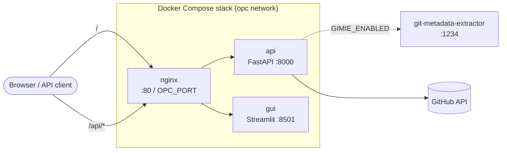

# Deployment Guide

## Docker Compose Stack (API + GUI + Nginx)

The repository includes `infra/docker-compose.yml` that orchestrates three services:

- `api`: FastAPI backend (`open_pulse_crawler.api:app`) on internal port `8000`
- `gui`: Streamlit app (`open_pulse_crawler.gui`) on internal port `8501`
- `nginx`: reverse proxy on external port `80` (or `OPC_PORT`) routing:
  - `/api/*` -> FastAPI
  - `/` -> Streamlit (including WebSocket upgrades)

The `api` and `gui` services pull a prebuilt image from the registry by default:
`ghcr.io/sdsc-ordes/open-pulse-crawler:latest`. Override with `OPC_IMAGE` if needed.

All services join the shared `opc` bridge network and use health checks so startup
ordering follows service readiness.



### Prerequisites

- Docker Engine 24+
- Docker Compose plugin (`docker compose`)

### Configure environment

Create a local `.env` file from the template:

```bash
cp .env.dist .env
```

Set at least:

```bash
GITHUB_TOKEN=ghp_your_token_here
API_TOKEN=your-api-token
```

Optional:

```bash
# Exposed host port for nginx (default: 80)
OPC_PORT=8080
```

### Start the full stack

```bash
docker compose -f infra/docker-compose.yml up -d --build
```

### Use a different application image (optional)

```bash
OPC_IMAGE=ghcr.io/sdsc-ordes/open-pulse-crawler:develop \
docker compose -f infra/docker-compose.yml up -d --build
```

### Pull latest image explicitly (optional)

```bash
docker compose -f infra/docker-compose.yml pull api gui
docker compose -f infra/docker-compose.yml up -d --build
```

Then open:

- Default (`OPC_PORT` unset): `http://localhost/` (GUI),
  `http://localhost/api/v1/health`, `http://localhost/api/v1/docs`
- Custom port (for example `OPC_PORT=8080`): `http://localhost:8080/`,
  `http://localhost:8080/api/v1/health`, `http://localhost:8080/api/v1/docs`

### Verify service health

```bash
docker compose -f infra/docker-compose.yml ps
```

Each service (`api`, `gui`, `nginx`) should report `healthy`.

### Stop the stack

```bash
docker compose -f infra/docker-compose.yml down
```

### Run the integration test script

The repository provides `tests/test_integration.sh` to build the stack and run
end-to-end HTTP checks through Nginx.

```bash
bash tests/test_integration.sh
```

Use a custom port if needed:

```bash
OPC_PORT=18080 bash tests/test_integration.sh
```

## Single-Container API Deployment

The project ships a multi-stage `Dockerfile` at `tools/image/Dockerfile` that
produces a small production image based on `python:3.12-slim`.

### Building the image

```bash
docker build -f tools/image/Dockerfile -t open-pulse-crawler .
```

### Running the container

```bash
docker run -d \
  --name opc-api \
  -p 8000:8000 \
  -e GITHUB_TOKEN="ghp_..." \
  -e API_TOKEN="my-secret-api-token" \
  open-pulse-crawler
```

The API will be available at `http://localhost:8000`. Visit
`http://localhost:8000/api/v1/health` to verify it is running.

### Environment variables

#### Required

| Variable       | Description                                       |
| -------------- | ------------------------------------------------- |
| `GITHUB_TOKEN` | GitHub personal access token(s), comma-separated. |
| `API_TOKEN`    | Bearer token required for protected endpoints.    |

#### Optional

| Variable                       | Default                                | Description                                                                                                  |
| ------------------------------ | -------------------------------------- | ------------------------------------------------------------------------------------------------------------ |
| `OPC_DATA_DIR`                 | `/tmp/open-pulse-crawler`              | Root directory for per-job artifacts (e.g. `<job_id>/jsonld/`). Mount a volume for persistence.              |
| `OPC_PORT`                     | `80`                                   | Host port the Nginx reverse proxy publishes.                                                                 |
| `OPC_IMAGE`                    | `ghcr.io/sdsc-ordes/open-pulse-crawler:latest` | Image tag used by the Compose stack.                                                                  |

#### Gimie hybrid extraction (optional)

These are server-side deployment knobs — clients do not pass them per-request. When
`GIMIE_ENABLED` is on, repository entries are enriched with JSON-LD metadata fetched
from a sibling `git-metadata-extractor` instance.

| Variable                     | Default                                  | Description                                                                                |
| ---------------------------- | ---------------------------------------- | ------------------------------------------------------------------------------------------ |
| `GIMIE_ENABLED`              | `false`                                  | Truthy values: `true` / `1` / `yes` / `on`. Off by default.                                |
| `GIMIE_API_BASE`             | `http://host.docker.internal:1234`       | Base URL of the gimie / git-metadata-extractor service.                                    |
| `GIMIE_STORE_JSONLD`         | `false`                                  | When on, persist per-repo JSON-LD payloads under `${OPC_DATA_DIR}/<job_id>/jsonld/`.       |
| `GIMIE_SKIP_EXISTING_JSONLD` | `false`                                  | When on, skip the gimie HTTP fetch for repos whose JSON-LD already exists on disk.         |

You can pass an env file instead:

```bash
docker run -d --env-file .env -p 8000:8000 open-pulse-crawler
```

### Customising uvicorn

Override the default CMD to change host, port, or worker count:

```bash
docker run -d \
  -p 8000:8000 \
  --env-file .env \
  open-pulse-crawler \
  --host 0.0.0.0 --port 8000 --workers 4
```

### Image details

| Property     | Value                            |
| ------------ | -------------------------------- |
| Base image   | `python:3.12-slim`               |
| Build tool   | `uv` (builder stage)             |
| Entrypoint   | `uvicorn open_pulse_crawler.api:app` |
| Exposed port | `8000`                           |
| Run user     | `app` (UID 1000, non-root)       |

## Running Without Docker

```bash
# Install the package (with uv or pip)
uv pip install -e ".[dev]"

# Start the API server
uvicorn open_pulse_crawler.api:app --host 0.0.0.0 --port 8000
```

Set `GITHUB_TOKEN` and `API_TOKEN` in your environment or a `.env` file before
starting the server.
