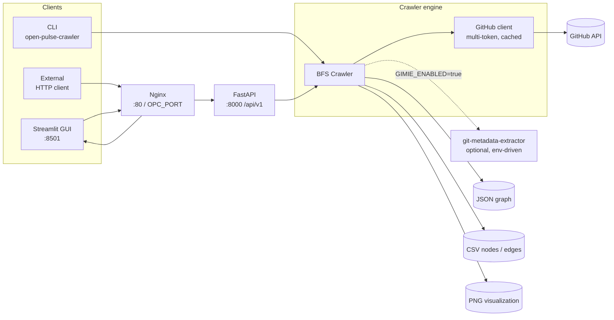

# Open Pulse Crawler

A GitHub crawler that runs a breadth-first search from a set of seed users / orgs / repos
and emits a graph of who-owns-what, who-contributes-to-what, who-depends-on-what — plus
optional JSON-LD enrichment via a sibling [gimie](https://github.com/sdsc-ordes/gimie)
service.

The same code is exposed three ways: as a Typer CLI, as a FastAPI REST service, and as
a Streamlit GUI fronted by Nginx. All three share the same crawler engine, GitHub client
(with multi-token rotation + caching), and output formats (JSON / CSV / PNG).

## Architecture



## Where to start

- [REST API reference](API.md) — every endpoint, request bodies, examples, and the job
  lifecycle (pause / resume / cancel). v3+ adds `/api/v2` for multi-platform crawls.
- [GitLab support](GITLAB.md) — supported instances, token scopes,
  per-instance quirks, and manual-test recipes for the v3 multi-platform
  crawler.
- [Zenodo support](ZENODO.md) — multi-instance Zenodo crawling with
  cross-platform `related_to` edges.
- [Deployment](DEPLOYMENT.md) — Docker Compose stack (API + GUI + Nginx), env vars,
  single-container builds, and the gimie-enrichment knobs.
- [Concurrency & rate limiting](CONCURRENCY.md) — multi-token rotation, semaphores,
  and the knobs that keep you under the GitHub rate limit.
- [Progress tracking](PROGRESS_TRACKING.md) and [Timestamps](TIMESTAMPS.md) — what the
  CLI prints and what the API exposes for live progress.
- [Visualization](VISUALIZATION.md) — the optional NetworkX + Matplotlib renderer.

## Quick start

```bash
export CRAWLER_GITHUB_TOKEN="ghp_…"
uv pip install -e ".[viz]"
open-pulse-crawler crawl torvalds sdsc-ordes/gimie --rounds 2 --visualize
```

The full Docker Compose path lives in [Deployment](DEPLOYMENT.md); the BFS algorithm and
output schema are documented in the project [README](https://github.com/sdsc-ordes/open-pulse-crawler#open-pulse-crawler).
